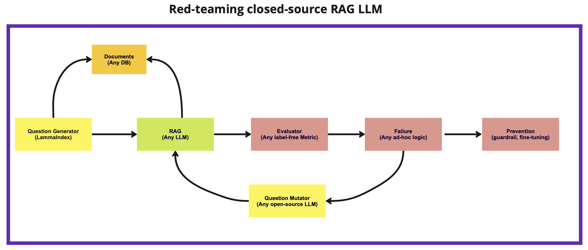

## Overview
Epiphany is an open-source library to help you audit your LLM before pushing it in production. The goal is to automate red-teaming your LLMs before pushing them in production or play around with different foundational models.

## Red-teaming LLMs

## Our approach

## Contributors
Christos Ziakas and Alp Karavil

## License

[Apache License 2.0](LICENSE)
